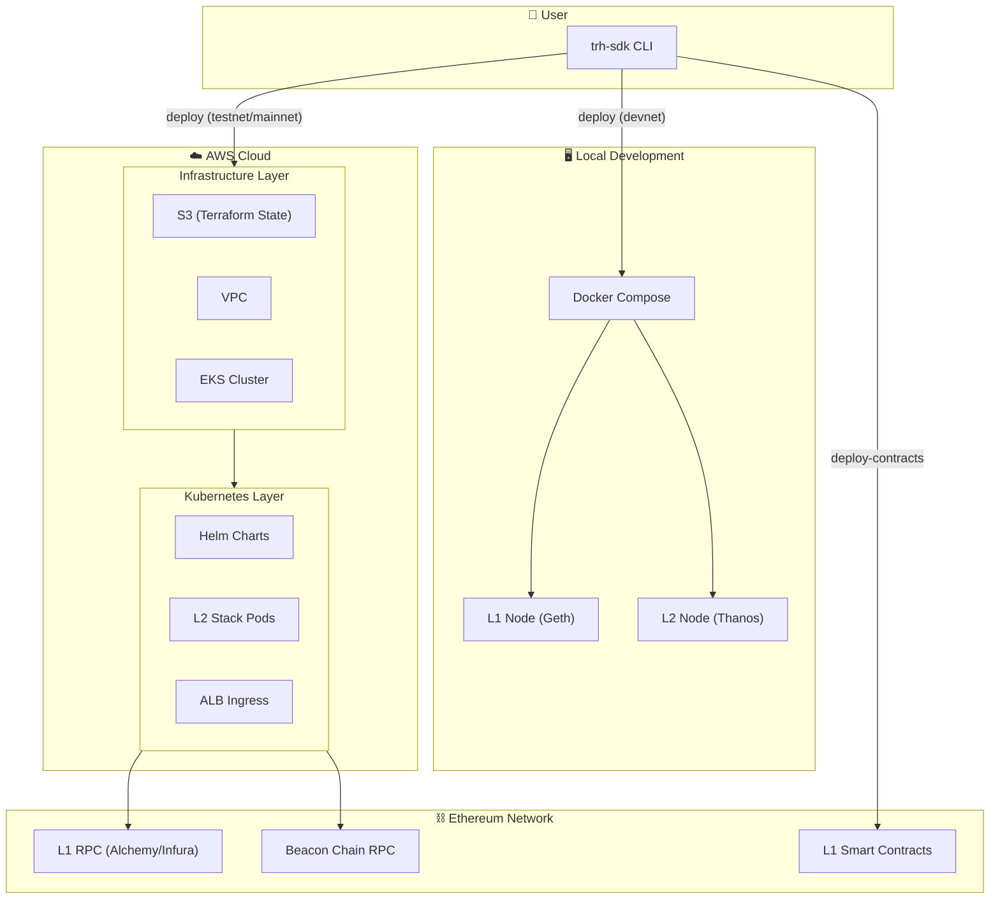
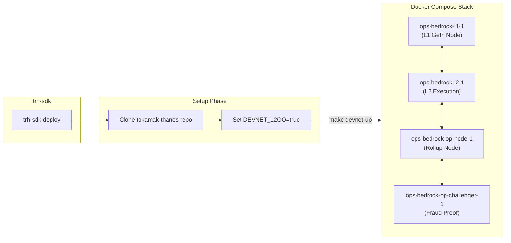
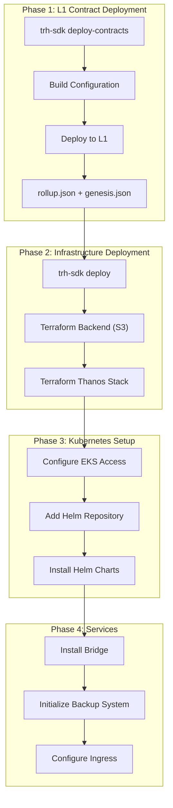
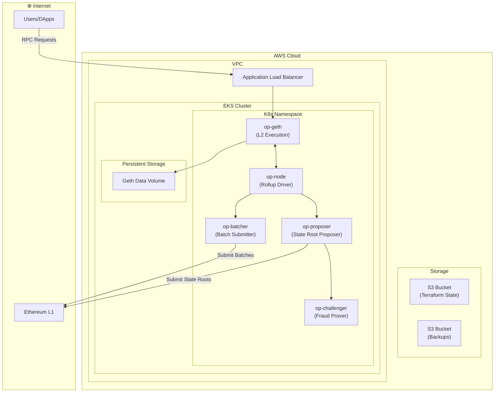
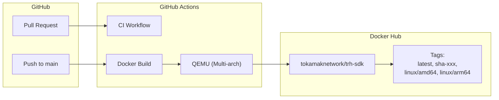
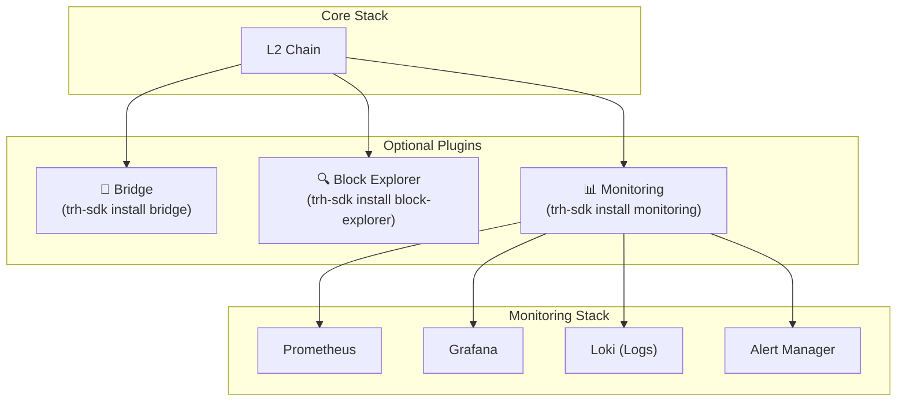
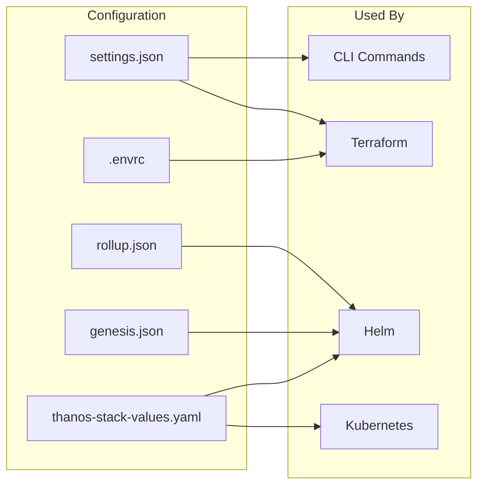

# Tokamak Rollup Hub SDK - Deployment Architecture

This document provides a comprehensive visual overview of the TRH-SDK deployment architecture.

---

## Glossary of Terms

Before diving into the architecture, here's an explanation of all technical terms used in this document:

### Infrastructure Components

| Term | Full Name | Description |
|------|-----------|-------------|
| **CLI** | Command Line Interface | The `trh-sdk` tool you run in your terminal to deploy and manage your L2 chain |
| **Docker Compose** | Docker Compose | A tool for defining and running multi-container Docker applications locally |
| **AWS** | Amazon Web Services | Cloud computing platform used for production deployments |
| **VPC** | Virtual Private Cloud | An isolated virtual network within AWS where all your resources run securely |
| **EKS** | Elastic Kubernetes Service | AWS-managed Kubernetes service that runs your containerized applications |
| **S3** | Simple Storage Service | AWS object storage used for Terraform state and backups |
| **ALB** | Application Load Balancer | AWS load balancer that distributes incoming traffic to your pods |
| **Infra** | Infrastructure | The underlying cloud resources (VPC, EKS, S3) that host your L2 chain |

### Kubernetes (K8s) Terms

| Term | Description |
|------|-------------|
| **K8s** | Short for Kubernetes - container orchestration platform that manages your application pods |
| **Pods** | The smallest deployable units in Kubernetes, containing one or more containers |
| **Helm** | Package manager for Kubernetes - used to deploy complex applications with a single command |
| **Helm Charts** | Pre-configured Kubernetes resource templates packaged for easy deployment |
| **Namespace** | Virtual cluster within Kubernetes to isolate resources (e.g., your chain's components) |
| **Ingress** | Kubernetes resource that manages external access to services (HTTP/HTTPS routing) |
| **PVC** | Persistent Volume Claim - request for storage that persists beyond pod restarts |

### Ethereum & L2 Components

| Term | Description |
|------|-------------|
| **L1** | Layer 1 - The base Ethereum blockchain (mainnet or testnet like Sepolia) |
| **L2** | Layer 2 - Your rollup chain built on top of Ethereum for faster, cheaper transactions |
| **L1RPC** | L1 RPC URL - HTTP endpoint to communicate with Ethereum (e.g., Alchemy, Infura) |
| **Beacon** | Beacon Chain RPC - Ethereum's consensus layer endpoint needed for L2 derivation |
| **Contracts** | Smart contracts deployed on L1 that anchor your L2 (bridges, state roots, etc.) |

### L2 Stack Components (Thanos/OP Stack)

| Component | Description |
|-----------|-------------|
| **op-geth** | L2 execution engine - processes transactions and maintains L2 state (fork of go-ethereum) |
| **op-node** | Rollup driver - derives L2 blocks from L1 data and coordinates with op-geth |
| **op-batcher** | Batch submitter - compresses L2 transactions and posts them to L1 as calldata |
| **op-proposer** | State root proposer - submits L2 state roots to L1 for verification |
| **op-challenger** | Fraud prover - monitors proposals and challenges invalid state roots |

### Deployment Terminology

| Term | Description |
|------|-------------|
| **Devnet** | Development network - local Docker-based environment for testing |
| **Testnet** | Test network - deployed to AWS but uses L1 testnet (Sepolia) for testing |
| **Mainnet** | Production network - deployed to AWS using Ethereum mainnet |
| **Terraform** | Infrastructure as Code tool - automates AWS resource provisioning |

### Data Flow Explained

```
Infra --> K8s      = AWS infrastructure hosts the Kubernetes cluster
K8s --> L1RPC      = Kubernetes pods connect to Ethereum L1 via RPC
K8s --> Beacon     = Kubernetes pods connect to Beacon Chain for consensus data
CLI --> Infra      = CLI tool provisions infrastructure via Terraform
CLI --> Contracts  = CLI deploys smart contracts to L1
```

---


## High-Level System Overview



---

## Deployment Modes

### 1️⃣ Local Devnet Deployment



### 2️⃣ Testnet/Mainnet AWS Deployment



---

## AWS Infrastructure Architecture



---

## CI/CD Pipeline



---

## Plugin Architecture



---

## Key Components Summary

| Component | Technology | Purpose |
|-----------|------------|---------|
| **CLI** | Go (urfave/cli) | User interface for all operations |
| **Infrastructure** | Terraform | Provision AWS resources (VPC, EKS, S3) |
| **Orchestration** | Kubernetes/EKS | Container management |
| **Deployment** | Helm Charts | K8s resource templating |
| **L2 Stack** | tokamak-thanos | OP Stack-based L2 |
| **CI/CD** | GitHub Actions | Automated builds and Docker pushes |
| **Monitoring** | Prometheus/Grafana | Metrics and alerting |

---

## Configuration Files


