# TRH-SDK Deployment Architecture - Security Analysis

## Executive Summary

This document provides a comprehensive security analysis of the **Tokamak Rollup Hub SDK** (trh-sdk), focusing on deployment architecture, threat modeling, and vulnerability assessment. Special emphasis is placed on the **AWS Parent Compromise** scenario—analyzing what an attacker could achieve if they gain control of the AWS infrastructure.

> [!CAUTION]
> This analysis reveals several **critical security weaknesses** in the current architecture, particularly around key management and secret storage. These should be addressed before any mainnet deployment.

---

## Table of Contents

1. [Architecture Overview](#architecture-overview)
2. [Component Deep Dive](#component-deep-dive)
3. [Security Boundaries](#security-boundaries)
4. [Threat Model: AWS Parent Compromise](#threat-model-aws-parent-compromise)
5. [Vulnerability Analysis](#vulnerability-analysis)
6. [Blast Radius Analysis](#blast-radius-analysis)
7. [Attack Vectors & Scenarios](#attack-vectors--scenarios)
8. [Recommendations](#recommendations)

---

## Architecture Overview

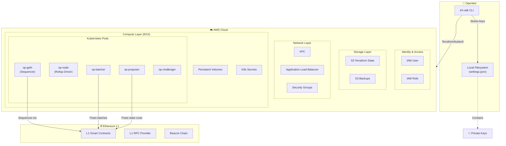

### Deployment Modes

| Mode | Infrastructure | Trust Model | Risk Level |
|------|---------------|-------------|------------|
| **Local Devnet** | Docker Compose | Fully trusted | 🟢 Low |
| **Testnet** | AWS EKS | Semi-trusted | 🟡 Medium |
| **Mainnet** | AWS EKS | Zero-trust required | 🔴 High |

---

## Component Deep Dive

### 1. CLI Tool (`trh-sdk`)

The CLI is a Go binary that orchestrates the entire deployment.

**Security-relevant operations:**

```go
// From pkg/types/configuration.go
type Config struct {
    AdminPrivateKey      string `json:"admin_private_key"`
    SequencerPrivateKey  string `json:"sequencer_private_key"`
    BatcherPrivateKey    string `json:"batcher_private_key"`
    ProposerPrivateKey   string `json:"proposer_private_key"`
    ChallengerPrivateKey string `json:"challenger_private_key,omitempty"`
    // AWS credentials also stored...
    AWS *AWSConfig `json:"aws,omitempty"`
}
```

> [!WARNING]
> **Critical Finding:** All private keys are stored in plaintext in `settings.json` with `0644` permissions.

### 2. Operator Keys

| Key | Purpose | Compromise Impact |
|-----|---------|-------------------|
| **Admin** | Deploy/upgrade contracts, change system params | 🔴 **CRITICAL** - Full system control |
| **Sequencer** | Order and sign L2 blocks | 🔴 **CRITICAL** - Transaction censorship, MEV extraction |
| **Batcher** | Submit L2 batch data to L1 | 🟡 **HIGH** - L2 liveness |
| **Proposer** | Submit state roots to L1 | 🔴 **CRITICAL** - Invalid state attacks |
| **Challenger** | Challenge invalid proposals | 🟡 **HIGH** - Unable to prevent fraud |

### 3. AWS Infrastructure

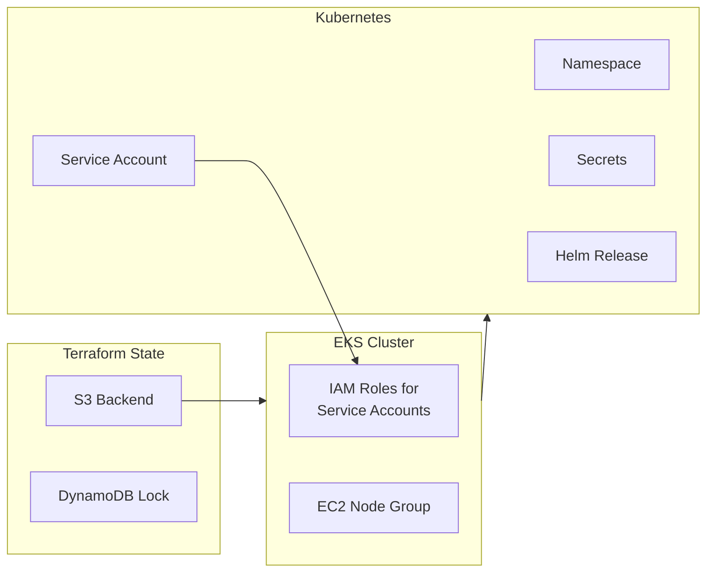

---

## Security Boundaries

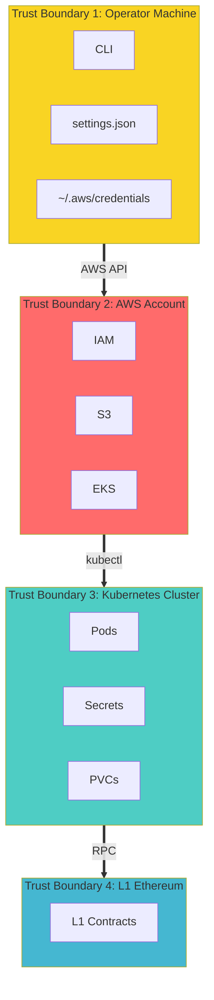

### Trust Boundary Violations

1. **TB1 → TB3**: Private keys flow from operator machine directly into K8s secrets
2. **TB2 → TB3**: AWS credentials embedded in pods for logging/backups
3. **No isolation**: All operator keys share the same security context

---

## Threat Model: AWS Parent Compromise

> [!IMPORTANT]
> **Scenario:** An attacker gains full control of the AWS account via:
> - Stolen IAM credentials
> - Compromised CI/CD pipeline (GitHub Actions secrets)
> - Insider threat
> - Supply chain attack

### What the Attacker Controls

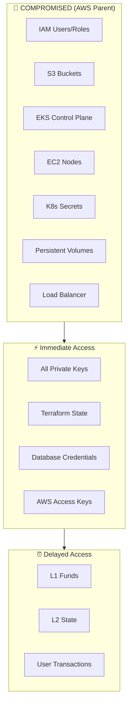

### Attack Timeline

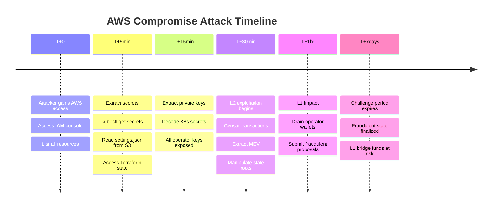

---

## Vulnerability Analysis

### Critical Vulnerabilities

#### 1. Plaintext Key Storage

```go
// pkg/types/configuration.go:172
err = os.WriteFile(fileName, data, 0644)  // World-readable!
```

**File contents:**
```json
{
  "admin_private_key": "0x...",
  "sequencer_private_key": "0x...",
  "batcher_private_key": "0x...",
  "proposer_private_key": "0x..."
}
```

| Aspect | Risk |
|--------|------|
| Storage location | Local filesystem, S3 backups |
| Encryption | ❌ None |
| Access control | ❌ File permissions only (0644) |
| Key rotation | ❌ No mechanism |

#### 2. Seed Phrase Exposure

```go
// pkg/stacks/thanos/input.go:254-259
fmt.Print("Please enter your admin seed phrase: ")
seed, err := scanner.ScanString()  // Plaintext input!
```

- Seed phrase entered in terminal (may be logged)
- Derived keys stored without encryption
- No hardware wallet support

#### 3. AWS Credentials in Plain Config

```go
// pkg/stacks/thanos/monitoring.go:659
"secretKey": t.deployConfig.AWS.SecretKey,  // Embedded in pod config
```

AWS credentials are:
- Stored in `settings.json`
- Passed to Helm values
- Embedded in pod environment variables
- Visible in Kubernetes secrets

#### 4. No Secret Rotation

- No mechanism to rotate keys
- Compromised key = permanent access
- No audit trail for key usage

### High-Risk Vulnerabilities

| Vulnerability | Impact | Exploitability |
|---------------|--------|----------------|
| K8s secrets unencrypted at rest | Key extraction | Easy with AWS access |
| Terraform state contains secrets | State rollback attacks | Easy with S3 access |
| No network policies | Pod-to-pod lateral movement | Easy from any pod |
| Helm values in ConfigMaps | Credential exposure | Easy with K8s access |
| No pod security policies | Container escape | Medium |

---

## Blast Radius Analysis

### If Attacker Compromises...

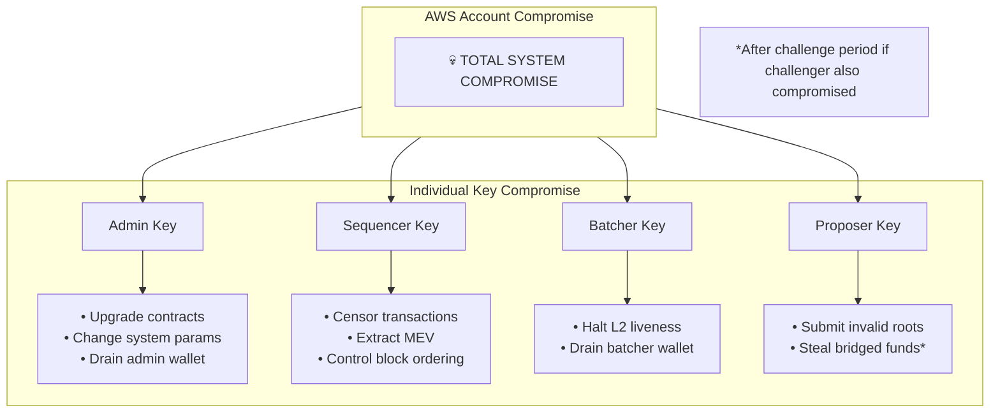

### Impact Matrix

| Compromised Component | L2 Liveness | L2 Safety | L1 Funds | User Funds |
|-----------------------|-------------|-----------|----------|------------|
| AWS Account | 🔴 | 🔴 | 🔴 | 🔴 |
| Admin Key | 🟡 | 🔴 | 🟡 | 🔴 |
| Sequencer Key | 🔴 | 🟡 | 🟢 | 🟡 |
| Batcher Key | 🔴 | 🟢 | 🟢 | 🟢 |
| Proposer Key | 🟢 | 🔴 | 🔴 | 🔴 |
| Challenger Key | 🟢 | 🔴 | 🔴 | 🔴 |

Legend: 🔴 Critical | 🟡 High | 🟢 Low/None

---

## Attack Vectors & Scenarios

### Scenario 1: Silent State Manipulation

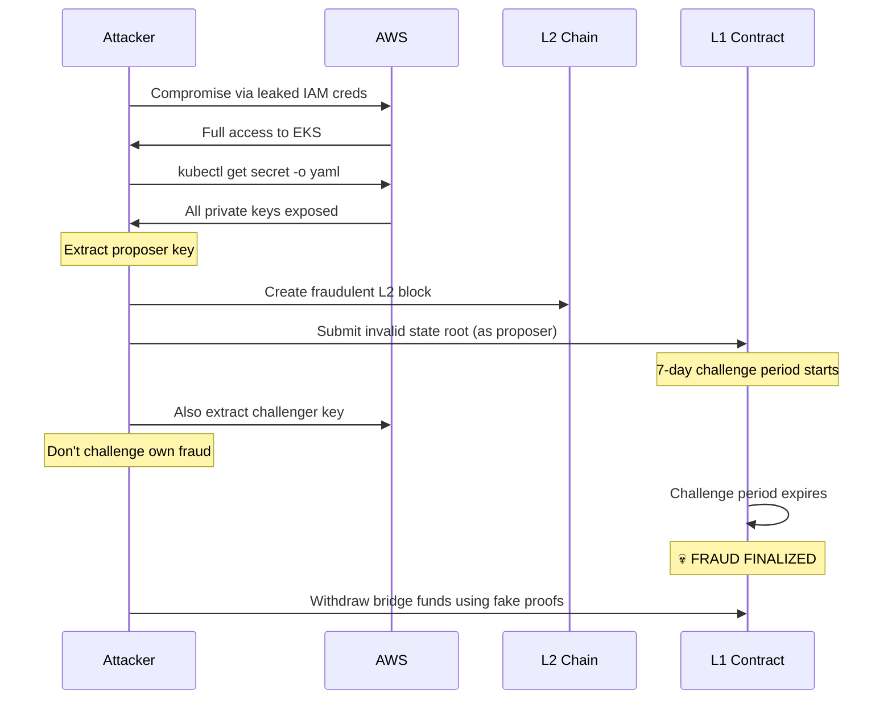

### Scenario 2: MEV Extraction & Censorship

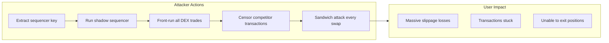

### Scenario 3: Supply Chain Attack via CI/CD

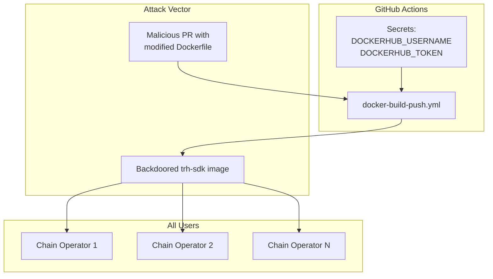

---

## Recommendations

### Immediate Actions (P0)

#### 1. Implement Secret Encryption

```diff
- err = os.WriteFile(fileName, data, 0644)
+ encryptedData := encryptWithKMS(data, kmsKeyId)
+ err = os.WriteFile(fileName, encryptedData, 0600)
```

#### 2. Use AWS KMS for Key Management

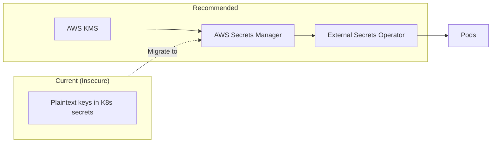

#### 3. Separate Key Management Per Role

| Key | Storage | Access Pattern |
|-----|---------|----------------|
| Admin | Hardware wallet / Cold storage | Manual multi-sig |
| Sequencer | AWS KMS with IRSA | Service account only |
| Batcher | AWS KMS with IRSA | Service account only |
| Proposer | AWS KMS with IRSA | Service account only |
| Challenger | Separate AWS account | Air-gapped |

### Short-term Actions (P1)

| Action | Effort | Impact |
|--------|--------|--------|
| Enable K8s secrets encryption at rest | Low | High |
| Implement network policies | Medium | High |
| Add pod security standards | Medium | Medium |
| Rotate all credentials regularly | Low | High |
| Implement audit logging | Low | High |

### Long-term Actions (P2)

1. **Multi-sig for Admin Key**
   - Require 3-of-5 signatures for contract upgrades
   
2. **Decentralized Sequencing**
   - Multiple independent sequencers
   - No single point of failure

3. **Hardware Security Modules (HSM)**
   - AWS CloudHSM for key operations
   - Never expose raw private keys

4. **Zero-Trust Architecture**
   ```mermaid
   flowchart TB
       subgraph ZeroTrust["Zero Trust Model"]
           Identity["Identity Verification"]
           MicroSeg["Micro-segmentation"]
           LeastPriv["Least Privilege"]
           Encrypt["Encrypt Everything"]
       end
   ```

---

## Risk Summary

| Risk Category | Current State | Target State |
|---------------|---------------|--------------|
| Key Management | 🔴 Critical | 🟢 HSM-backed |
| Secret Storage | 🔴 Critical | 🟢 Encrypted + KMS |
| Access Control | 🟡 Weak | 🟢 RBAC + Network Policies |
| Audit Trail | 🔴 None | 🟢 CloudTrail + EKS Audit |
| Incident Response | 🔴 None | 🟢 Runbooks + Auto-remediation |

---

## Detailed Mitigation Strategies

### 1. Key Management Mitigation

**Current Problem:** Private keys stored in plaintext `settings.json` file with world-readable permissions.

**Why This Is Critical:**
- Anyone with filesystem access can read all operator keys
- Keys are copied to K8s secrets without encryption
- No separation between different key roles
- Single point of compromise = total system loss

**Mitigation Approach:**

#### Step 1: Use AWS KMS for Key Encryption

```go
// BEFORE (Insecure)
type Config struct {
    AdminPrivateKey string `json:"admin_private_key"`  // Plaintext!
}

// AFTER (Secure)
type Config struct {
    AdminPrivateKeyEncrypted string `json:"admin_private_key_encrypted"`
    KMSKeyARN                string `json:"kms_key_arn"`
}

// Decrypt only when needed
func (c *Config) GetAdminPrivateKey(ctx context.Context) (string, error) {
    kmsClient := kms.NewFromConfig(awsCfg)
    result, err := kmsClient.Decrypt(ctx, &kms.DecryptInput{
        CiphertextBlob: base64Decode(c.AdminPrivateKeyEncrypted),
        KeyId:          aws.String(c.KMSKeyARN),
    })
    return string(result.Plaintext), err
}
```

#### Step 2: Implement AWS Secrets Manager Integration

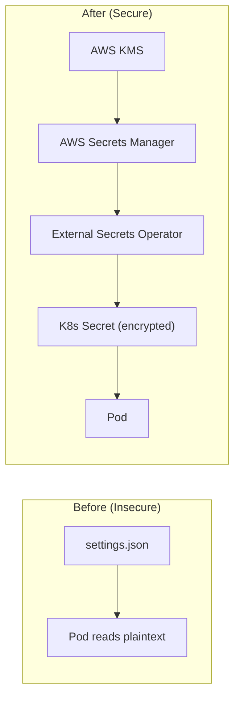

**Implementation Steps:**

1. **Create KMS Key:**
   ```bash
   aws kms create-key --description "TRH-SDK Operator Keys" \
     --key-usage ENCRYPT_DECRYPT \
     --origin AWS_KMS
   ```

2. **Store in Secrets Manager:**
   ```bash
   aws secretsmanager create-secret \
     --name "trh-sdk/operator-keys" \
     --secret-string '{"sequencer":"0x...","batcher":"0x..."}' \
     --kms-key-id alias/trh-sdk-keys
   ```

3. **Install External Secrets Operator:**
   ```bash
   helm install external-secrets external-secrets/external-secrets \
     -n external-secrets --create-namespace
   ```

4. **Create ExternalSecret Resource:**
   ```yaml
   apiVersion: external-secrets.io/v1beta1
   kind: ExternalSecret
   metadata:
     name: operator-keys
   spec:
     refreshInterval: 1h
     secretStoreRef:
       name: aws-secrets-manager
       kind: ClusterSecretStore
     target:
       name: operator-keys
     data:
       - secretKey: sequencer-key
         remoteRef:
           key: trh-sdk/operator-keys
           property: sequencer
   ```

#### Step 3: Hardware Wallet for Admin Key

**Why:** Admin key should NEVER be on any server.

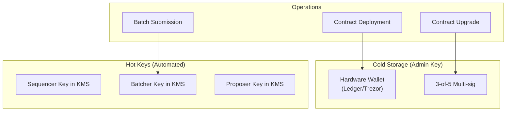

---

### 2. Secret Storage Mitigation

**Current Problem:** Secrets visible in multiple places without encryption.

**Locations Where Secrets Are Exposed:**
1. `settings.json` on local machine
2. S3 backups (if configured)
3. Terraform state in S3
4. Kubernetes secrets (base64, not encrypted)
5. Pod environment variables
6. CloudWatch logs (potentially)

**Mitigation Approach:**

#### Enable EKS Secrets Encryption

```bash
# Create encryption config
aws eks update-cluster-config \
  --name thanos-cluster \
  --encryption-config '[{
    "provider": {"keyArn": "arn:aws:kms:us-east-1:123456789:key/abc123"},
    "resources": ["secrets"]
  }]'
```

#### Encrypt Terraform State

```hcl
# backend.tf
terraform {
  backend "s3" {
    bucket         = "trh-terraform-state"
    key            = "prod/terraform.tfstate"
    region         = "us-east-1"
    encrypt        = true  # Enable server-side encryption
    kms_key_id     = "arn:aws:kms:us-east-1:123456789:key/abc123"
    dynamodb_table = "terraform-locks"
  }
}
```

#### Prevent Secret Logging

```yaml
# Pod spec with secret masking
apiVersion: v1
kind: Pod
spec:
  containers:
    - name: op-batcher
      env:
        - name: BATCHER_PRIVATE_KEY
          valueFrom:
            secretKeyRef:
              name: operator-keys
              key: batcher-key
      # Never echo secrets in logs
      command:
        - /bin/sh
        - -c
        - |
          # Mask secrets in process list
          exec /app/op-batcher --private-key-file=/secrets/key
```

---

### 3. Access Control Mitigation

**Current Problem:** No RBAC, no network policies, pods can access everything.

**Mitigation Approach:**

#### Kubernetes RBAC

```yaml
# Restrict secret access to specific pods
apiVersion: rbac.authorization.k8s.io/v1
kind: Role
metadata:
  name: batcher-role
  namespace: thanos-stack
rules:
  - apiGroups: [""]
    resources: ["secrets"]
    resourceNames: ["batcher-key"]  # Only this secret
    verbs: ["get"]
---
apiVersion: rbac.authorization.k8s.io/v1
kind: RoleBinding
metadata:
  name: batcher-binding
subjects:
  - kind: ServiceAccount
    name: batcher-sa
roleRef:
  kind: Role
  name: batcher-role
  apiGroup: rbac.authorization.k8s.io
```

#### Network Policies

```yaml
# Isolate batcher pod - only allow outbound to L1 RPC
apiVersion: networking.k8s.io/v1
kind: NetworkPolicy
metadata:
  name: batcher-network-policy
spec:
  podSelector:
    matchLabels:
      app: op-batcher
  policyTypes:
    - Ingress
    - Egress
  ingress: []  # No inbound allowed
  egress:
    - to:
        - ipBlock:
            cidr: 0.0.0.0/0  # Allow L1 RPC (external)
      ports:
        - port: 443
          protocol: TCP
    - to:
        - podSelector:
            matchLabels:
              app: op-node  # Allow op-node communication
      ports:
        - port: 8545
```

#### AWS IAM Least Privilege

```json
{
  "Version": "2012-10-17",
  "Statement": [
    {
      "Effect": "Allow",
      "Action": [
        "secretsmanager:GetSecretValue"
      ],
      "Resource": [
        "arn:aws:secretsmanager:*:*:secret:trh-sdk/batcher-key-*"
      ],
      "Condition": {
        "StringEquals": {
          "aws:PrincipalTag/Role": "batcher"
        }
      }
    }
  ]
}
```

---

### 4. Audit Trail Mitigation

**Current Problem:** No logging of who accessed what, when.

**Mitigation Approach:**

#### Enable CloudTrail for All AWS Actions

```hcl
resource "aws_cloudtrail" "trh_audit" {
  name                          = "trh-sdk-audit-trail"
  s3_bucket_name                = aws_s3_bucket.audit_logs.id
  include_global_service_events = true
  is_multi_region_trail         = true
  enable_log_file_validation    = true
  
  kms_key_id = aws_kms_key.audit.arn
  
  event_selector {
    read_write_type           = "All"
    include_management_events = true
    
    data_resource {
      type   = "AWS::SecretsManager::Secret"
      values = ["arn:aws:secretsmanager:*:*:secret:trh-sdk/*"]
    }
  }
}
```

#### EKS Audit Logging

```bash
aws eks update-cluster-config \
  --name thanos-cluster \
  --logging '{"clusterLogging":[
    {"types":["api","audit","authenticator","controllerManager","scheduler"],
     "enabled":true}
  ]}'
```

#### CloudWatch Alerts for Suspicious Activity

```yaml
# Alert on secret access from unknown IPs
Resources:
  SecretAccessAlarm:
    Type: AWS::CloudWatch::Alarm
    Properties:
      AlarmName: SuspiciousSecretAccess
      MetricName: SecretAccessCount
      Namespace: TRH-SDK/Security
      Statistic: Sum
      Period: 300
      EvaluationPeriods: 1
      Threshold: 10
      ComparisonOperator: GreaterThanThreshold
      AlarmActions:
        - !Ref SecurityAlertTopic
```

---

### 5. Incident Response Mitigation

**Current Problem:** No procedures for detecting or responding to breaches.

**Mitigation Approach:**

#### Automated Key Rotation Runbook

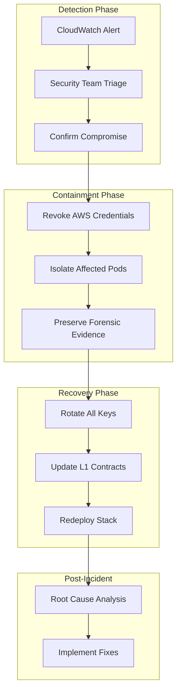

#### Emergency Key Rotation Script

```bash
#!/bin/bash
# emergency-key-rotation.sh

set -e

echo "🚨 EMERGENCY KEY ROTATION INITIATED"

# 1. Generate new keys
NEW_SEQ_KEY=$(cast wallet new | grep Private | awk '{print $3}')
NEW_BATCH_KEY=$(cast wallet new | grep Private | awk '{print $3}')
NEW_PROP_KEY=$(cast wallet new | grep Private | awk '{print $3}')

# 2. Update Secrets Manager
aws secretsmanager update-secret \
  --secret-id trh-sdk/operator-keys \
  --secret-string "{\"sequencer\":\"$NEW_SEQ_KEY\",\"batcher\":\"$NEW_BATCH_KEY\",\"proposer\":\"$NEW_PROP_KEY\"}"

# 3. Force secret refresh in K8s
kubectl annotate externalsecret operator-keys \
  force-sync=$(date +%s) --overwrite

# 4. Rolling restart of affected pods
kubectl rollout restart deployment/op-batcher -n thanos-stack
kubectl rollout restart deployment/op-proposer -n thanos-stack

# 5. Update L1 contracts with new addresses (requires admin multi-sig)
echo "⚠️  MANUAL STEP: Update SystemConfig with new operator addresses"
echo "   New Sequencer: $(cast wallet address $NEW_SEQ_KEY)"
echo "   New Batcher:   $(cast wallet address $NEW_BATCH_KEY)"
echo "   New Proposer:  $(cast wallet address $NEW_PROP_KEY)"

echo "✅ Emergency rotation complete"
```

#### Incident Response Checklist

| Phase | Action | Owner | Time |
|-------|--------|-------|------|
| **Detection** | Alert triggered in CloudWatch | Automated | T+0 |
| **Detection** | Security team notified via PagerDuty | Automated | T+1m |
| **Triage** | Confirm if genuine compromise | Security Lead | T+15m |
| **Contain** | Revoke compromised IAM credentials | Security Lead | T+20m |
| **Contain** | Scale down affected deployments | DevOps | T+25m |
| **Contain** | Block compromised IPs at ALB | DevOps | T+30m |
| **Recover** | Execute key rotation script | Security Lead | T+45m |
| **Recover** | Multi-sig update L1 contracts | Admin Quorum | T+2h |
| **Recover** | Redeploy with new credentials | DevOps | T+3h |
| **Review** | Root cause analysis | All | T+24h |
| **Harden** | Implement preventive measures | Engineering | T+1w |

---

## Implementation Priority Matrix

| Mitigation | Effort | Impact | Priority |
|------------|--------|--------|----------|
| Enable EKS secrets encryption | 🟢 Low | 🟡 High | **P0** |
| Change file permissions to 0600 | 🟢 Low | 🟡 Medium | **P0** |
| Implement External Secrets Operator | 🟡 Medium | 🔴 Critical | **P0** |
| Add Kubernetes RBAC roles | 🟡 Medium | 🟡 High | **P1** |
| Deploy network policies | 🟡 Medium | 🟡 High | **P1** |
| Enable CloudTrail + EKS audit | 🟢 Low | 🟡 High | **P1** |
| Create incident response runbooks | 🟡 Medium | 🟡 Medium | **P1** |
| Migrate to AWS CloudHSM | 🔴 High | 🔴 Critical | **P2** |
| Implement admin multi-sig | 🔴 High | 🔴 Critical | **P2** |
| Decentralize sequencer | 🔴 Very High | 🔴 Critical | **P3** |

---

> [!CAUTION]
> **Do not deploy to mainnet** until at least P0 recommendations are implemented. Current architecture has multiple critical vulnerabilities that could result in total loss of funds.
